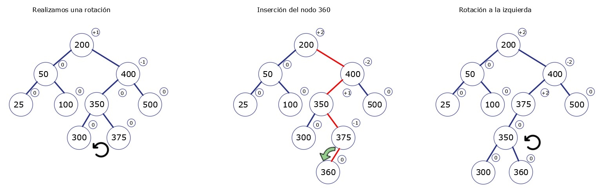

<div align="center">
<table>
    <theader>
        <tr>
            <td></td>
            <th>
                <span style="font-weight:bold;">UNIVERSIDAD NACIONAL DE SAN AGUSTIN</span><br />
                <span style="font-weight:bold;">FACULTAD DE INGENIERÍA DE PRODUCCIÓN Y SERVICIOS</span><br />
                <span style="font-weight:bold;">ESCUELA PROFESIONAL DE INGENIERÍA DE SISTEMAS</span>
            </th>
            <td></td>
        </tr>
    </theader>
    <tbody>
        <tr><td colspan="3"><span style="font-weight:bold;">Formato</span>: Guía de Práctica de Laboratorio / Talleres / Centros de Simulación</td></tr>
        <tr><td><span style="font-weight:bold;">Aprobación</span>:  2022/03/01</td><td><span style="font-weight:bold;">Código</span>: GUIA-PRLE-001</td><td><span style="font-weight:bold;">Página</span>: 1</td></tr>
    </tbody>
</table>
</div>

<div align="center">
<span style="font-weight:bold;">INFORME DE LABORATORIO</span><br />

<table>
<theader>
<tr><th colspan="6">INFORMACIÓN BÁSICA</th></tr>
</theader>
<tbody>
<tr><td>ASIGNATURA:</td><td colspan="5">Estructura de Datos y Algoritmos</td></tr>
<tr><td>TÍTULO DE LA PRÁCTICA:</td><td colspan="5">Árboles</td></tr>
<tr>
<td>NÚMERO DE PRÁCTICA:</td><td>05</td><td>AÑO LECTIVO:</td><td>2022 A</td><td>NRO. SEMESTRE:</td><td>III</td>
</tr>
<tr>
<td>FECHA DE PRESENTACIÓN:</td><td>28/06/2022</td><td>HORA DE PRESENTACIÓN: 11:55 pm</td><td colspan="3"></td>
</tr>
<tr><td colspan="3">INTEGRANTE(s):
<ul>
      			<li><a href="https://github.com/fernandocoylaA">Fernando Jesús Coyla Alvarez</a></li>
			<li><a href="https://github.com/Icielo23">Valery Cielo Iquise Mamani</a></li>
			<li><a href="https://github.com/Mario-Chura">Mario Franco Chura Puma</a></li>
</ul>
</td>
<td>NOTA:</td><td colspan="2"></td>
</<tr>
<tr><td colspan="6">DOCENTE(s):
<ul>
<li>Richart Smith Escobedo Quispe - rescobedoq@unsa.edu.pe</li>
</ul>
</td>
</<tr>
</tbody>
</table>
</div>
  

  
<div align="center"><h2> SOLUCIÓN Y RESULTADOS </h2></div>

### I.	SOLUCIÓN DE EJERCICIOS/PROBLEMAS
#	
1.  Ejercicio 1 : Corchetes equilibrados
	- Procedimiento
	El metodo isBalance recibe unicamente una cadena compuesta de (,{,[,],},) esta cadena es procesada por un ciclo for , cada simbolo es almacenado en la variable "simbolo" de tipo char ; despues pasa por una serie de if .
	El primer if verifica si es algun simbolo de apertura, si lo es , se pushea a una pila previamente creada ; por otro lado si es un simbolo de cerradura es procesado en un else if , este bloque primero verifica si la pila esta vacia con el fin de que este simbolo de cerradura tenga su simbolo de apertura correspondiente , tambien se verifica que el tope de la pila sea distinto del simbolo de apertura en ambos casos se retorna la cadena "NO" esto se extiende para los simbolos : 
	},],) 
	Finalmente si no a ocurrido ninguna excepcion en el ciclo for significa que la pila esta vacia y por lo tanto la cadena ingresada es valida asi retornando un "SI" .
	
	```py
			public static String isBalanced(String cadena) {
        			Stack<Character> pila  = new Stack<Character>();
        
        			for(int i = 0; i < cadena.length(); i++) {
            			char simbolo = cadena.charAt(i);
            
            			if(simbolo == '[' || simbolo == '(' || simbolo == '{' ) {     
               			 pila.push(simbolo);
            			} else if(simbolo == ']') {
                			if(pila.isEmpty() || pila.pop() != '[')
                    			return "No";
        
            			} else if(simbolo== ')') {
                			if(pila.isEmpty() || pila.pop() != '(')
                    			return "No"; 
                             
            			} else if(simbolo == '}') {
                			if(pila.isEmpty() || pila.pop() != '{')
                   			 return "No";
           			 }        
        			}  
       			 if (pila.isEmpty())
        				return "Si";
        			else
        			return "No";
			}
      ```
	
	

2.  Ejercicio 2 : Operaciones de árbol AVL
- Para este ejercicio tienes que escribir el paso a paso del desarrollo de cada operación donde se muestra gráficamente el estado del árbol así como el factor de equilibrio para cada nodo y el tipo de operación que se está realizando, es decir, inserción, eliminación, rotación.
	- Paso 1 realizaremos operaciones de agregación de los siguientes valores: 100 - 200 - 300 - 400 - 500 - 50 - 25 - 350 - 375 - 360 - 355 - 150 - 175 - 120 - 190.
		-	Se inserta el nodo 100 como la raíz.
		-	Se inserta el nodo 200, dado a que 200 > 100, lo insertamos en el subárbol derecho.
		-	Se inserta el nodo 300, dado a que 300 > 100 y 300 > 200, lo insertamos en el subárbol derecho.
		-	Como el factor de equilibrio de la raíz es +2 realizamos una rotación hacia la izquierda.
		-	Se inserta el nodo 400, dado a que 400>200 y 400>300, los insertamos a la derecha de 300.


		
		
		-	Se inserta el nodo 500, dado a que 500>200, 500>300 y 500>400, lo insertamos a la derecha de 400.
		-	Como el factor de equilibrio del nodo 300 es +2 realizamos una rotación hacia la izquierda.
		-	Se inserta el nodo 50, dado que 50<200 y 50<100, lo insertamos a la izquierda de 100
		-	Se inserta el nodo 25, dado que 25<200, 25<100, 25<50, lo insertamos a la izquierda de 50.

		
		

		-	Como el factor de equilibro del nodo 100 es -2 realizamos una rotación a la derecha
		-	Se inserta el nodo 350, dado que 350>200, 350<400 y 350>300, lo insertamos a la derecha del nodo 300.
		-	Se inserta el nodo 375, dado que 375>200, 375<400, 375>300 y 375>350 , lo insertamos a la derecha del nodo 350.


		
		
		-	En la inserción anterior el factor de equilibrio del nodo 300 era de +2 por ello realizamos una rotación hacia la izquierda.
		-	Se inserta el nodo 360, dado que 360>200, 360<400, 360>350 y 360<375, lo insertamos a la izquierda del nodo 375.
		-	Como el factor de equilibrio del nodo 400 es -2 primero realizamos una rotación hacia la izquierda, pero ahora tenemos en nodo 375 con un factor de equilibrio de +2.


		

		-	Para llegar al equilibrio en el árbol AVL, ahora realizamos una rotación hacia la derecha y así llegamos al equilibrio.
		-	Se inserta el nodo 355, dado que 355>200, 355<375, 355>350 y 355<360, lo insertamos a la izquierda del nodo 360.
		-	Como el factor de equilibrio del nodo 200 es +2 realizamos una rotación a la derecha, pero aun el factor de equilibrio del nodo 200 es +2, así que necesitaremos hacer otra rotación.


		
		
		
		-	Para llegar al equilibrio realizamos una rotación a la izquierda, donde el nodo 350 será nuestra nueva raíz.
		-	Se inserta el nodo 150, dado que 150<350, 150<200, 150>50 y 150>100, lo insertamos a la derecha del nodo 100.
		-	Como el factor de equilibrio del nodo 200 es -2, primero realizamos una rotación hacia izquierda, pero aun su factor de equilibrio es de -2.


		
		
		
		-	Para equilibrar nuestro árbol realizamos una rotación hacia la derecha y logramos el equilibrio.
		-	Se inserta el nodo 175, dado que 175<350, 175>100, 175<200 y 175>150, lo insertamos a la derecha del nodo 150.


		
		
		
		-	Se inserta el nodo 120, dado que 120<350, 120>100, 120<200 y 120<150, lo insertamos a la izquierda del nodo 120.
		-	Se inserta el nodo 190, dado que 190<350, 190>100, 190<200, 190>150 y 190>175, lo insertamos a la derecha del nodo 175.


		
		
		
		-	Dado a que el factor de equilibrio del nodo 200 es -2 después de la inserción del nodo 190, realizamos primero una rotación hacia la izquierda y por último una rotación hacia la derecha y así logramos el equilibrio en nuestro árbol AVL.

		
		
		

	-  Paso 2 realizaremos la eliminación de los siguientes valores: 100 - 200 - 300 - 400 - 500 - 50 - 25 - 350 - 375 - 360 - 355 - 150 - 175 - 120 - 190.

		-	Realizaremos nuestras operaciones de eliminación de nodos a partir de nuestro árbol AVL generado anteriormente el cual es el que se muestra en la siguiente imagen:
		
		
		
		-	Eliminando nodo 100 caso III: El nodo 100 tiene dos hijos. En este caso, encontramos el sucesor de 100, el nodo más a la izquierda en el subárbol derecho, el cual es el menor de todos, que lo reemplazará. El sucesor es la hoja 120 con el cual efectuaremos el intercambio.
		
		

		-	Eliminando nodo 200 caso III: El nodo 200 tiene dos hijos. En este caso, encontramos el sucesor de 200, en este caso podemos escoger cualquiera de los dos hijos para ser padre, nosotros escogeremos en nodo 300 que reemplazara a 200.
		
		
		
		-	Eliminando nodo 300 caso II: El nodo 300 solo tiene un hijo, el nodo 190 por eso el será su reemplazo.
		
		
		
		-	Eliminando nodo 400 caso II: El nodo 400 solo tiene un hijo, el nodo 500, por eso el será su reemplazo.
		
		
		
		-	Eliminando nodo 500 caso I: El nodo 500 es una hoja por lo que solo lo quitamos, como el factor de equilibrio del nodo 375 a raíz de esta eliminación toma el valor de -2, realizamos un giro hacia la derecha para tener de nuevo equilibrio en nuestro árbol AVL.
		
		
		
		-	Eliminando nodo 50 caso II: El nodo 50 solo tiene como hijo el nodo 25, este nodo será su reemplazo.
		
		
		
		-	Eliminando nodo 25 caso I: El nodo 25 es una hoja por lo que solo lo quitamos, como el factor de equilibrio del nodo 120 a raíz de esta eliminación toma el valor de +2, realizamos un giro hacia la izquierda para tener de nuevo equilibrio en nuestro árbol AVL.
		
		
		
		-	Eliminando nodo 350 caso III: El nodo 350 tiene dos hijos. En este caso, encontramos el sucesor de 350, el nodo más a la izquierda en el subárbol derecho, el cual es el menor de todos, que lo reemplazará. El sucesor es la hoja 355 con el cual efectuaremos el intercambio.
		
		
		
		-	Eliminando nodo 375 caso I: El nodo 375 es una hoja por lo que solo lo quitamos, como el factor de equilibrio del nodo 355 a raíz de esta eliminación toma el valor de -2, realizamos un giro hacia la derecha para tener de nuevo equilibrio en nuestro árbol AVL
		
		
		
		-	Eliminando nodo 360 caso I: El nodo 360 es una hoja por lo que solo lo quitamos.
		-	Eliminando nodo 355 caso II: El nodo 355 solo tiene como hijo el nodo 190 este nodo será su reemplazo. 

		
		
	
		-	Eliminando nodo 150 caso I: El nodo 150 es una hoja por lo que solo lo quitamos.
		-	Eliminando nodo 175 caso III: El nodo 175 tiene dos hijos. En este caso, encontramos el sucesor de 175, en este caso podemos escoger cualquiera de los dos hijos para ser padre, nosotros escogeremos en nodo 190 que reemplazara a 175.
		-	Eliminando nodo 120 caso I: El nodo 120 es una hoja por lo que solo lo quitamos.

		
		
		
#

3.  Ejercicio 3 : Árbol AVL
- En este ejercicio se implemento la clase Node para un AVL, que tiene los mismo que un nodo para BST, con la diferencia que se agrega el factor de balance
	```sh
	public class Node<T> {
    	 private T data;
    	 private int balanceFactor;
    	 private Node<T> rightNode;
    	 private Node<T> leftNode;
    	 /*.../*
	
 	```
- En la clase AVLTree se implemento los atributos root(raiz) y height(altura) este ultimo un booleno para el desarrollo de la insercion.
	```sh
	 protected Node<T> root;
     private boolean height;
	```
- Para la insercion se implemento dos clases insert una publica manejada por el usuario y otra protegida para el desarrollo del metodo
- En el metodo insert protected(protegido) se realizan condicionales con el nodo ingresado, si es null simplemente se devuelve y se crea el nodo
	```sh
	if(current == null){
            this.height = true;
            res = new Node(x);
        }
	```
- En otro caso creamos una variable para realizar comparacion entre el data del nodo y el valor a insertar, se realiza de esta manera porque se esta trabajando con clases genericas.
	```sh
	int resC= current.getData().compareTo(x);
	```
- Si es es cero el no ya fue insertado, si es menor a cero, se trabaja con el nodo derecho. Y se llama de vuelta al mismo metodo insert, enviando al valor x a insertar y el nodo derecho.
	```sh
	res.setRightNode(insertRec(x, current.getRightNode()));
	```
- Luego de esto se realiza un condicional con el atributo height, si es verdadero se realiza un switch con el factor de balance de "res" nuestro valor auxiliar, para determinar segun sea el caso el cabio de balance de la variable "res" y cambiar el valor del atributo "height" a false o true segun el caso.
	```sh
	if(this.height){
                    switch(res.getBalanceFactor()){
                        case -1: res.setBalanceFactor(0); this.height=false; break;
                        case 0: res.setBalanceFactor(1);  this.height=true; break;
                        case 1: //caso factor de balance 2
                                res = balanceToLeft(res); //se realiza el balanceo
                                this.height=false;
                                break;
                    }
        }
	```
- En caso que no cumpla el condicional significaria trabajar con el nodo izquierdo, se realiza lo mismo que en el caso anterior(nodo derecho), cambiando los casos en la sentencia switch
	```sh
	switch(res.getBalanceFactor()){
                        case 1: res.setBalanceFactor(0); this.height=false; break;
                        case 0: res.setBalanceFactor(-1); this.height=true; break;
                        case -1: //caso factor de balance -2
                                res = balanceToRight(res); //se realiza el balanceo
                                this.height=false; break;
        }
	```
- Los metodos adicionales que se implementaron son balanceToLeft y balanceToRight, que nos sirven para realizar las rotaciones simple o doble, a la izquierda o derecha segun el caso.
- En estos metodos se trabaja con hijo y nieto del nodo(derecho o izquierdo segun el caso), en la sentencia switch con el factor de balance del hijo del nodo. Caso 0 o 1 se realiza la rotacion simple izquierda, caso -1 rotacion doble izquierda
	```sh
	switch(son.getBalanceFactor()){
            case 0:
            case 1: node.setBalanceFactor(0);
                    son.setBalanceFactor(0);
                    System.out.println("Rotacion Simple Izquierda");
                    node = rotateSL(node); break;                    
            case -1: Node<T> grandson = son.getLeftNode();
                    switch(grandson.getBalanceFactor()){
                        case -1 :node.setBalanceFactor(0); son.setBalanceFactor(1);break;
                        case 0 : node.setBalanceFactor(0); son.setBalanceFactor(0);break;
                        case 1 : node.setBalanceFactor(-1); son.setBalanceFactor(0);break;
                    }
                    grandson.setBalanceFactor(0);
                    System.out.println("Rotacion Doble Izquierda");
                    node.setRightNode(rotateSR(son)); 
                    node = rotateSL(node);                                       
                    break;
        }
	```
- Se realiza lo mismo para el balanceo a la derecha, cambiando los casos del switch con el factor de balance del hijo del nodo. Caso 0 o -1 se realiza la rotacion simple Derecha, caso 1 rotacion doble Derecha
- Adicionalmente para realizar las rotaciones izquierda y derecha se implementaron estos metodos
	```sh
	//Rotacion derecha
	private Node<T> rotateSL(Node<T> node){
        Node<T> son = node.getRightNode();
        node.setRightNode(son.getLeftNode());
        son.setLeftNode(node);
        node = son;
        return node;
    }
	```
- Simetricamente se realiza para la rotacion izquierda
- Para la Busqueda, no es diferente a la busqueda en BST porque simplemente se realiza una consulta se devuelve el dato si se encuentra y si no se devuelve no encontrado
- Cuenta igualmente con un metodo publico y otro protegido donde se realiza el desarrollo, se realiza con condicionales y usando recursividad en la busqueda para finalmente retornar el dato buscado
	```sh
	int resC = current.getData().compareTo(x);
        if(resC<0)	return searchNode(x, current.getRightNode());
        else if(resC>0)	return searchNode(x, current.getLeftNode());
        else	return current;
	```
- Para la mostrar en consola se implemento un metodo para el recorrido del arbol AVL en inOrden, y se uso en el metodo toString
#

### II.	SOLUCIÓN DEL CUESTIONARIO


#

### III.	CONCLUSIONES
#
- Los árboles binarios son eficientes mientras sean pequeños, pero a medida que estos crecen se hacen ineficientes porque para que funcione serán necesarios condiciones de balanceo, pero si el balanceo es perfecto será muy costoso mantenerlo, es por ello que los arboles AVL nos da ese balanceo con tolerancia +-1 en su factor de equilibrio de modo que su balanceo es poco costoso dándonos un orden en sus operaciones de O(log n). <br>
- Los árboles AVL, además de cumplir con la propiedad de orden de los BST, cumple el equilibrio con sus nodos las alturas de sus subárboles izquierdo y derecho no difieren en más de 1, Esto permite que su coste de operación sea O(log2 n), porque el equilibrio se basa en reequilibrados locales, de modo que no es necesario explorar todo el árbol después de cada inserción. Por cumplir con esta propiedades consideramos que son muy eficientes al trabajar con ellos<br>
- El trabajo propuesto hace que los conceptos de pila sean más claros, así como, nos ayuda a evaluar cuándo realizar los métodos pop(), push() e isEmpty() y cómo aplicarlos correctamente <br>

#
<div align="center"><h2>  RETROALIMENTACIÓN GENERAL </h2></div> <br>

<div align="center"><h2> REFERENCIAS Y BIBLIOGRAFÍA </h2></div> <br>

-   https://www.youtube.com/watch?v=r72a5MxQaJQ&ab_channel=DANYFU
-   https://www.cs.usfca.edu/~galles/visualization/AVLtree.html
-   https://www.youtube.com/watch?v=Qexq1k8LB6k&ab_channel=makigas%3Atutorialesdeprogramaci%C3%B3n
-   https://estructurasite.wordpress.com/arbol/
