

<table>
    <theader>
        <tr>
            <td></td>
            <th>
                UNIVERSIDAD NACIONAL DE SAN AGUSTIN 
                FACULTAD DE INGENIERÍA DE PRODUCCIÓN Y SERVICIOS 
                ESCUELA PROFESIONAL DE INGENIERÍA DE SISTEMAS
            </th>
            <td></td>
        </tr>
    </theader>
    <tbody>
        <tr><td colspan="3">Formato: Guía de Práctica de Laboratorio / Talleres / Centros de Simulación</td></tr>
        <tr><td>Aprobación:  2022/03/01</td><td>Código: GUIA-PRLE-001</td><td>Página: 1</td></tr>
    </tbody>
</table>

INFORME DE LABORATORIO 

<table>
<theader>
<tr><th colspan="6">INFORMACIÓN BÁSICA</th></tr>
</theader>
<tbody>
<tr><td>ASIGNATURA:</td><td colspan="5">Estructura de Datos y Algoritmos</td></tr>
<tr><td>TÍTULO DE LA PRÁCTICA:</td><td colspan="5">Árboles</td></tr>
<tr>
<td>NÚMERO DE PRÁCTICA:</td><td>05</td><td>AÑO LECTIVO:</td><td>2022 A</td><td>NRO. SEMESTRE:</td><td>III</td>
</tr>
<tr>
<td>FECHA DE PRESENTACIÓN:</td><td>28/06/2022</td><td>HORA DE PRESENTACIÓN: 11:55 pm</td><td colspan="3"></td>
</tr>
<tr><td colspan="3">INTEGRANTE(s):
<ul>
      			<li><a href="https://github.com/fernandocoylaA">Fernando Jesús Coyla Alvarez</a></li>
			<li><a href="https://github.com/Icielo23">Valery Cielo Iquise Mamani</a></li>
			<li><a href="https://github.com/Mario-Chura">Mario Franco Chura Puma</a></li>
</ul>
</td>
<td>NOTA:</td><td colspan="2"></td>
</<tr>
<tr><td colspan="6">DOCENTE(s):
<ul>
<li>Richart Smith Escobedo Quispe - rescobedoq@unsa.edu.pe</li>
</ul>
</td>
</<tr>
</tbody>
</table>

  

  

<h2> SOLUCIÓN Y RESULTADOS </h2>

### I.	SOLUCIÓN DE EJERCICIOS/PROBLEMAS
#	
1.  Ejercicio 1 : Corchetes equilibrados
	- Procedimiento
2.  Ejercicio 2 : Operaciones de árbol AVL
- Para este ejercicio tienes que escribir el paso a paso del desarrollo de cada operación donde se muestra gráficamente el estado del árbol así como el factor de equilibrio para cada nodo y el tipo de operación que se está realizando, es decir, inserción, eliminación, rotación.
	- Paso 1 realizaremos operaciones de agregación de los siguientes valores: 100 - 200 - 300 - 400 - 500 - 50 - 25 - 350 - 375 - 360 - 355 - 150 - 175 - 120 - 190.
		-	Se inserta el nodo 100 como la raíz.
		-	Se inserta el nodo 200, dado a que 200 > 100, lo insertamos en el subárbol derecho.
		-	Se inserta el nodo 300, dado a que 300 > 100 y 300 > 200, lo insertamos en el subárbol derecho.
		-	Como el factor de equilibrio de la raíz es +2 realizamos una rotación hacia la izquierda.
		-	Se inserta el nodo 400, dado a que 400>200 y 400>300, los insertamos a la derecha de 300.

		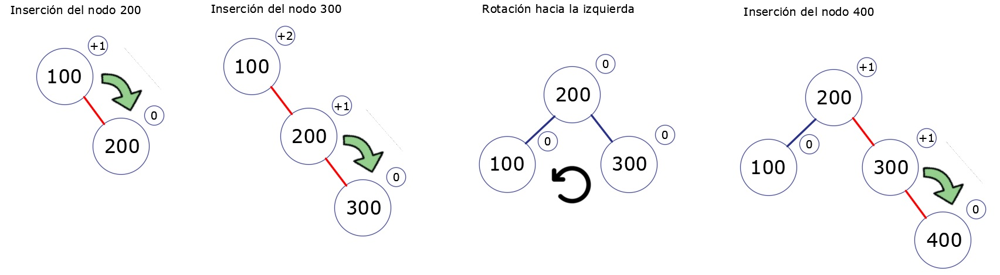
		
		-	Se inserta el nodo 500, dado a que 500>200, 500>300 y 500>400, lo insertamos a la derecha de 400.
		-	Como el factor de equilibrio del nodo 300 es +2 realizamos una rotación hacia la izquierda.
		-	Se inserta el nodo 50, dado que 50<200 y 50<100, lo insertamos a la izquierda de 100
		-	Se inserta el nodo 25, dado que 25<200, 25<100, 25<50, lo insertamos a la izquierda de 50.

		
		

		-	Como el factor de equilibro del nodo 100 es -2 realizamos una rotación a la derecha
		-	Se inserta el nodo 350, dado que 350>200, 350<400 y 350>300, lo insertamos a la derecha del nodo 300.
		-	Se inserta el nodo 375, dado que 375>200, 375<400, 375>300 y 375>350 , lo insertamos a la derecha del nodo 375.

		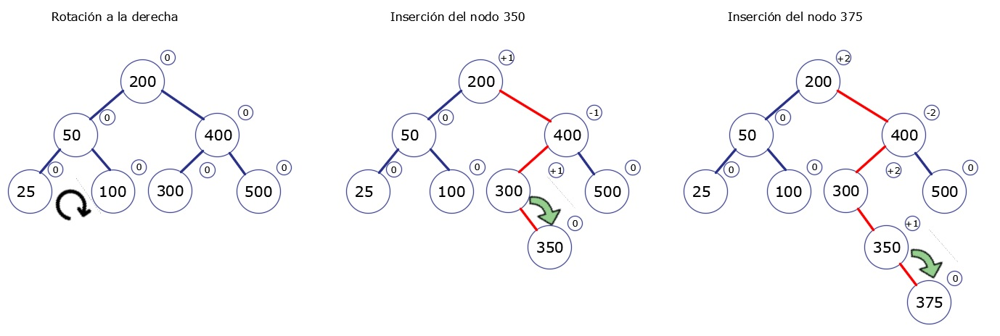
		
		-	1
		-	2
		-	3
		-	4.

		
		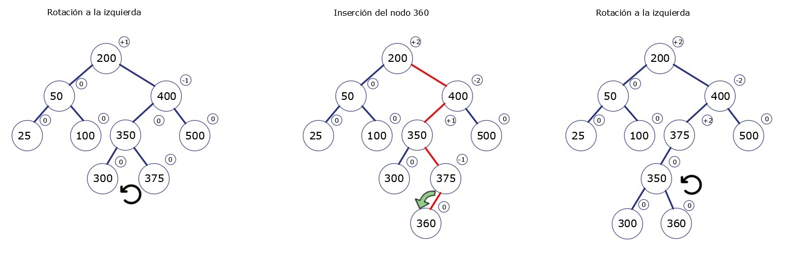

		-	1
		-	2
		-	3
		-	4.

		
		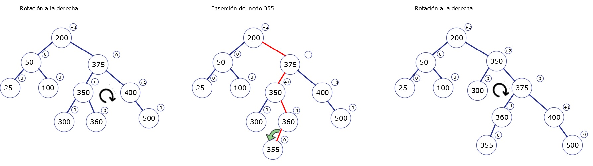
		
		-	1
		-	2
		-	3
		-	4.

		
		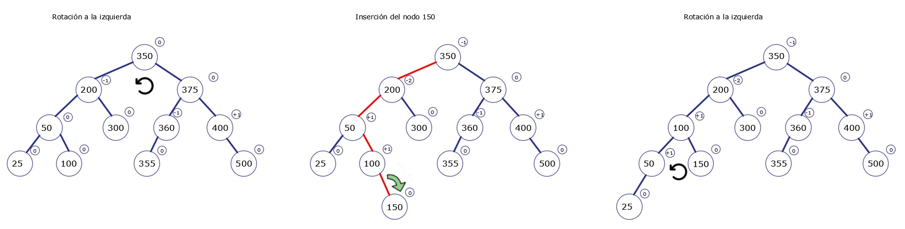
		
		-	1
		-	2
		-	3
		-	4.

		
		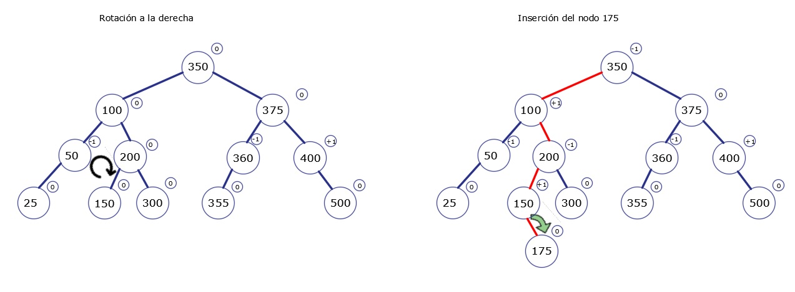
		
		-	1
		-	2
		-	3
		-	4.

		
		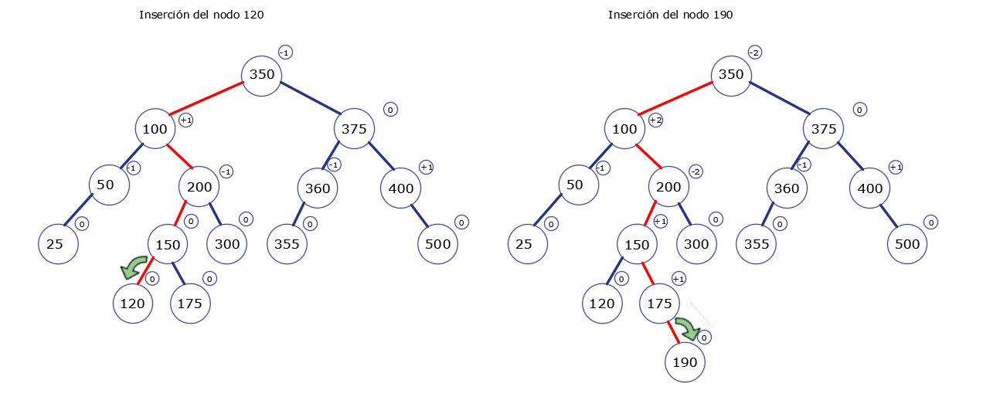
		
		-	1
		-	2
		-	3
		-	4.

		
		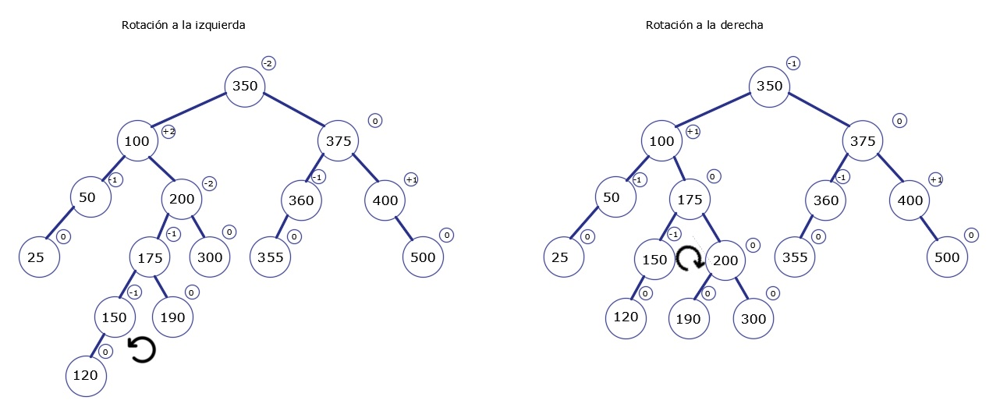
		

	-  Paso 2 realizaremos la eliminación de los siguientes valores: 100 - 200 - 300 - 400 - 500 - 50 - 25 - 350 - 375 - 360 - 355 - 150 - 175 - 120 - 190.

		-	1
		-	2
		
		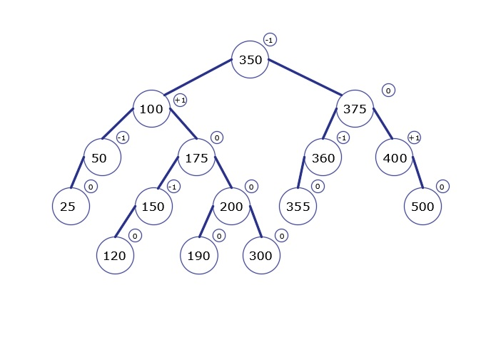
		
		-	1
		-	2
		
		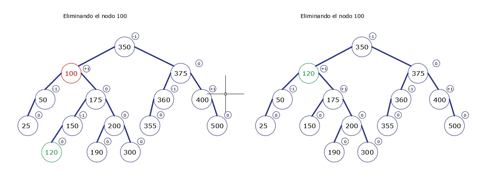

		-	1
		-	2
		
		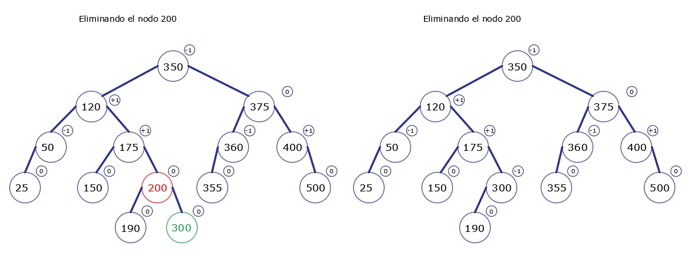
		
		-	1
		-	2
		
		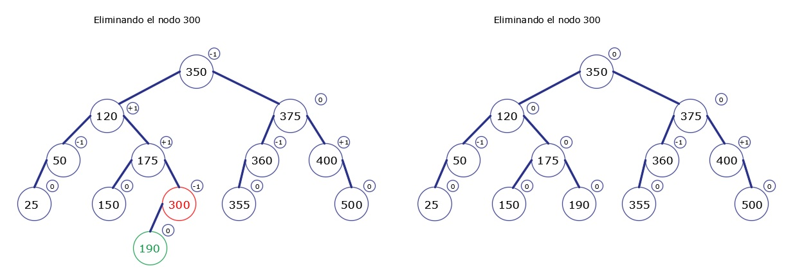
		
		-	1
		-	2
		
		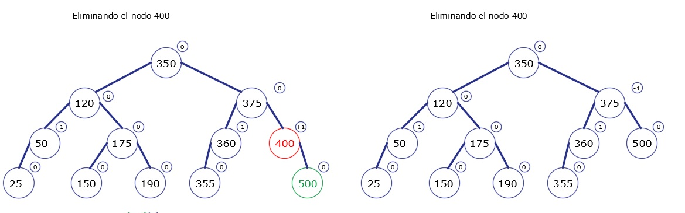
		
		-	1
		-	2
		
		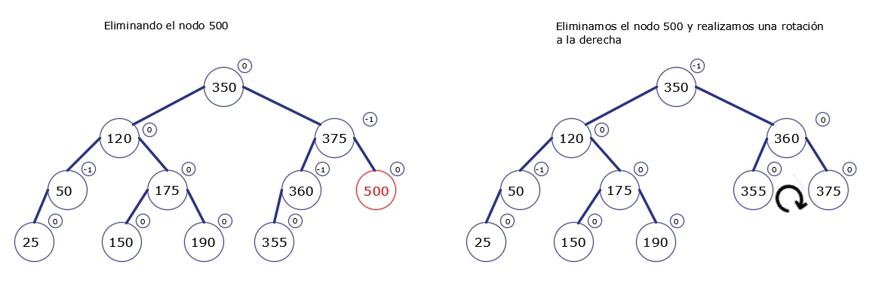
		
		-	1
		-	2
		
		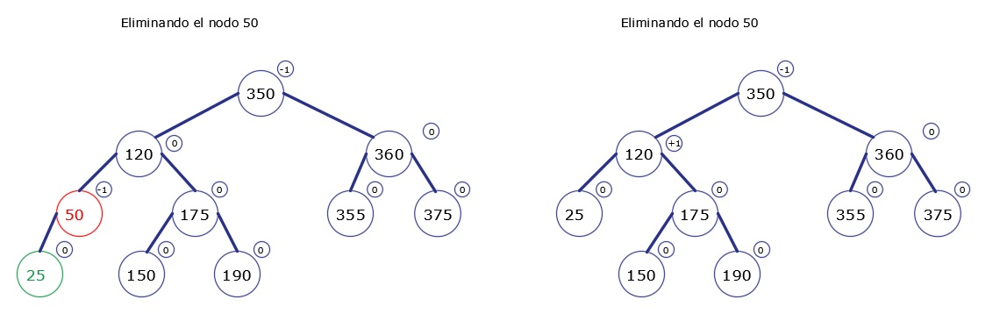
		
		-	1
		-	2
		
		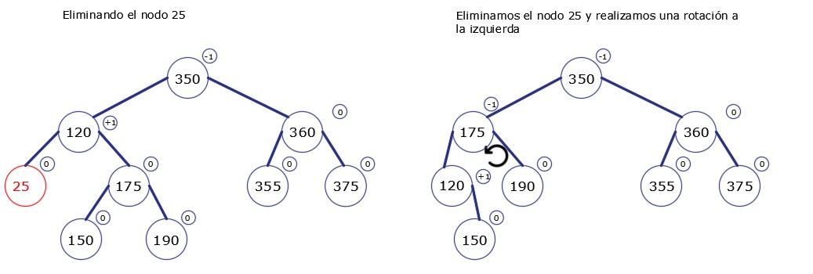
		
		-	1
		-	2
		
		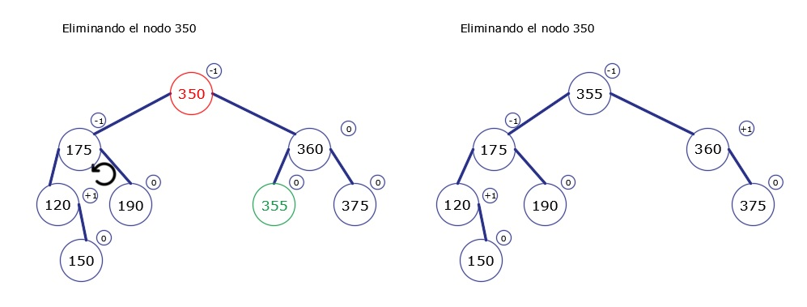
		
		-	1
		-	2
		
		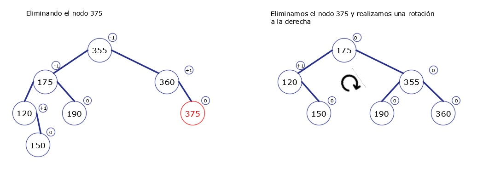
		
		-	1
		-	2
		
		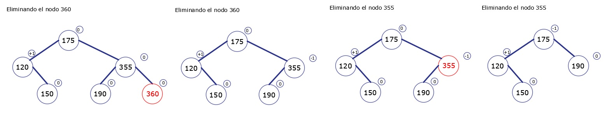
	
		-	1
		-	2
		
		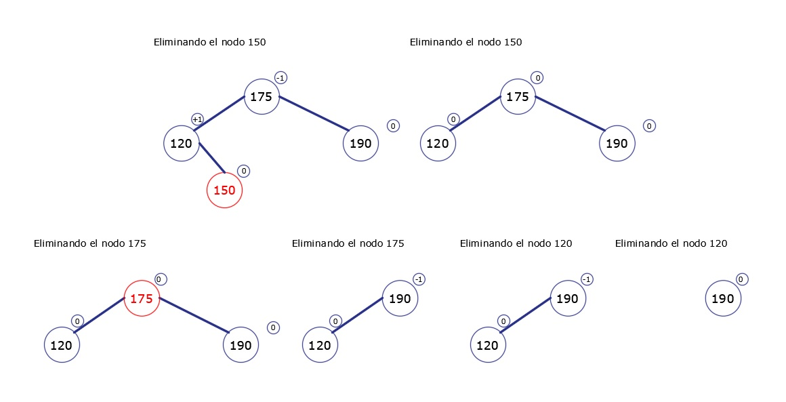
		
#

3.  Ejercicio 3 : Árbol AVL
	- Procedimiento
	
   
#

### II.	SOLUCIÓN DEL CUESTIONARIO

#

### III.	CONCLUSIONES
#
-Conclusion 1  
-Conclusion 2  
-Conclusion 3  
-Conclusion 4  
-Conclusion 5  
#

<h2>  RETROALIMENTACIÓN GENERAL </h2>
  

<h2> REFERENCIAS Y BIBLIOGRAFÍA </h2>
  

-   https://www.youtube.com/watch?v=r72a5MxQaJQ&ab_channel=DANYFU
-   https://www.cs.usfca.edu/~galles/visualization/AVLtree.html
-   https://www.youtube.com/watch?v=Qexq1k8LB6k&ab_channel=makigas%3Atutorialesdeprogramaci%C3%B3n
-   https://estructurasite.wordpress.com/arbol/
