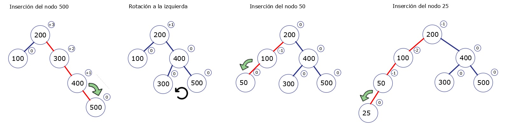
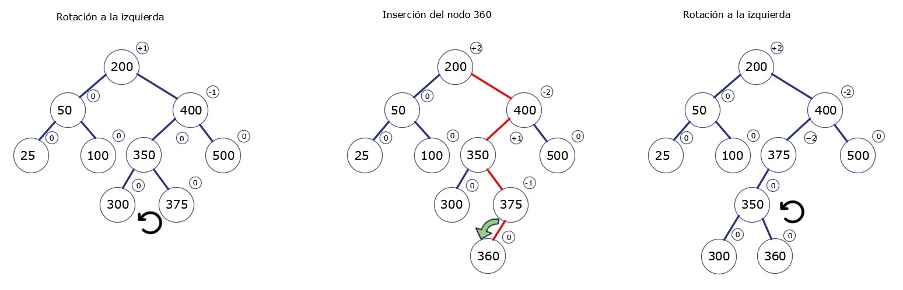

<table>
    <theader>
        <tr>
            <td></td>
            <th>
                UNIVERSIDAD NACIONAL DE SAN AGUSTIN 
                FACULTAD DE INGENIERÍA DE PRODUCCIÓN Y SERVICIOS 
                ESCUELA PROFESIONAL DE INGENIERÍA DE SISTEMAS
            </th>
            <td></td>
        </tr>
    </theader>
    <tbody>
        <tr><td colspan="3">Formato: Guía de Práctica de Laboratorio / Talleres / Centros de Simulación</td></tr>
        <tr><td>Aprobación:  2022/03/01</td><td>Código: GUIA-PRLE-001</td><td>Página: 1</td></tr>
    </tbody>
</table>

INFORME DE LABORATORIO 

<table>
<theader>
<tr><th colspan="6">INFORMACIÓN BÁSICA</th></tr>
</theader>
<tbody>
<tr><td>ASIGNATURA:</td><td colspan="5">Estructura de Datos y Algoritmos</td></tr>
<tr><td>TÍTULO DE LA PRÁCTICA:</td><td colspan="5">Árboles</td></tr>
<tr>
<td>NÚMERO DE PRÁCTICA:</td><td>05</td><td>AÑO LECTIVO:</td><td>2022 A</td><td>NRO. SEMESTRE:</td><td>III</td>
</tr>
<tr>
<td>FECHA DE PRESENTACIÓN:</td><td>28/06/2022</td><td>HORA DE PRESENTACIÓN: 11:55 pm</td><td colspan="3"></td>
</tr>
<tr><td colspan="3">INTEGRANTE(s):
<ul>
      			<li><a href="https://github.com/fernandocoylaA">Fernando Jesús Coyla Alvarez</a></li>
			<li><a href="https://github.com/Icielo23">Valery Cielo Iquise Mamani</a></li>
			<li><a href="https://github.com/Mario-Chura">Mario Franco Chura Puma</a></li>
</ul>
</td>
<td>NOTA:</td><td colspan="2"></td>
</<tr>
<tr><td colspan="6">DOCENTE(s):
<ul>
<li>Richart Smith Escobedo Quispe - rescobedoq@unsa.edu.pe</li>
</ul>
</td>
</<tr>
</tbody>
</table>

  

  

<h2> SOLUCIÓN Y RESULTADOS </h2>

### I.	SOLUCIÓN DE EJERCICIOS/PROBLEMAS
#	
1.  Ejercicio 1 : Corchetes equilibrados
	- Procedimiento
2.  Ejercicio 2 : Operaciones de árbol AVL
- Para este ejercicio tienes que escribir el paso a paso del desarrollo de cada operación donde se muestra gráficamente el estado del árbol así como el factor de equilibrio para cada nodo y el tipo de operación que se está realizando, es decir, inserción, eliminación, rotación.
	- Paso 1 realizaremos operaciones de agregación de los siguientes valores: 100 - 200 - 300 - 400 - 500 - 50 - 25 - 350 - 375 - 360 - 355 - 150 - 175 - 120 - 190.
		-	Se inserta el nodo 100 como la raíz.
		-	Se inserta el nodo 200, dado a que 200 > 100, lo insertamos en el subárbol derecho.
		-	Se inserta el nodo 300, dado a que 300 > 100 y 300 > 200, lo insertamos en el subárbol derecho.
		-	Como el factor de equilibrio de la raíz es +2 realizamos una rotación hacia la izquierda.
		-	Se inserta el nodo 400, dado a que 400>200 y 400>300, los insertamos a la derecha de 300.

		
		
		-	Se inserta el nodo 500, dado a que 500>200, 500>300 y 500>400, lo insertamos a la derecha de 400.
		-	Como el factor de equilibrio del nodo 300 es +2 realizamos una rotación hacia la izquierda.
		-	Se inserta el nodo 50, dado que 50<200 y 50<100, lo insertamos a la izquierda de 100
		-	Se inserta el nodo 25, dado que 25<200, 25<100, 25<50, lo insertamos a la izquierda de 50.

		
		

		-	Como el factor de equilibro del nodo 100 es -2 realizamos una rotación a la derecha
		-	Se inserta el nodo 350, dado que 350>200, 350<400 y 350>300, lo insertamos a la derecha del nodo 300.
		-	Se inserta el nodo 375, dado que 375>200, 375<400, 375>300 y 375>350 , lo insertamos a la derecha del nodo 350.

		
		
		-	En la inserción anterior el factor de equilibrio del nodo 300 era de +2 por ello realizamos una rotación hacia la izquierda.
		-	Se inserta el nodo 360, dado que 360>200, 360<400, 360>350 y 360<375, lo insertamos a la izquierda del nodo 375.
		-	Como el factor de equilibrio del nodo 400 es -2 primero realizamos una rotación hacia la izquierda, pero ahora tenemos en nodo 375 con un factor de equilibrio de +2.

		

		-	Para llegar al equilibrio en el árbol AVL, ahora realizamos una rotación hacia la derecha y así llegamos al equilibrio.
		-	Se inserta el nodo 355, dado que 355>200, 355<375, 355>350 y 355<360, lo insertamos a la izquierda del nodo 360.
		-	Como el factor de equilibrio del nodo 200 es +2 realizamos una rotación a la derecha, pero aun el factor de equilibrio del nodo 200 es +2, así que necesitaremos hacer otra rotación.

		
		
		
		-	Para llegar al equilibrio realizamos una rotación a la izquierda, donde el nodo 350 será nuestra nueva raíz.
		-	Se inserta el nodo 150, dado que 150<350, 150<200, 150>50 y 150>100, lo insertamos a la derecha del nodo 100.
		-	Como el factor de equilibrio del nodo 200 es -2, primero realizamos una rotación hacia izquierda, pero aun su factor de equilibrio es de -2.

		
		
		
		-	Para equilibrar nuestro árbol realizamos una rotación hacia la derecha y logramos el equilibrio.
		-	Se inserta el nodo 175, dado que 175<350, 175>100, 175<200 y 175>150, lo insertamos a la derecha del nodo 150.

		
		
		
		-	Se inserta el nodo 120, dado que 120<350, 120>100, 120<200 y 120<150, lo insertamos a la izquierda del nodo 120.
		-	Se inserta el nodo 190, dado que 190<350, 190>100, 190<200, 190>150 y 190>175, lo insertamos a la derecha del nodo 175.

		
		
		
		-	Dado a que el factor de equilibrio del nodo 200 es -2 después de la inserción del nodo 190, realizamos primero una rotación hacia la izquierda y por último una rotación hacia la derecha y así logramos el equilibrio en nuestro árbol AVL.

		
		
		

	-  Paso 2 realizaremos la eliminación de los siguientes valores: 100 - 200 - 300 - 400 - 500 - 50 - 25 - 350 - 375 - 360 - 355 - 150 - 175 - 120 - 190.

		-	Realizaremos nuestras operaciones de eliminación de nodos a partir de nuestro árbol AVL generado anteriormente el cual es el que se muestra en la siguiente imagen:
		
		
		
		-	Eliminando nodo 100 caso III: El nodo 100 tiene dos hijos. En este caso, encontramos el sucesor de 100, el nodo más a la izquierda en el subárbol derecho, el cual es el menor de todos, que lo reemplazará. El sucesor es la hoja 120 con el cual efectuaremos el intercambio.
		
		

		-	Eliminando nodo 200 caso III: El nodo 200 tiene dos hijos. En este caso, encontramos el sucesor de 200, en este caso podemos escoger cualquiera de los dos hijos para ser padre, nosotros escogeremos en nodo 300 que reemplazara a 200.
		
		
		
		-	Eliminando nodo 300 caso II: El nodo 300 solo tiene un hijo, el nodo 190 por eso el será su reemplazo.
		
		
		
		-	Eliminando nodo 400 caso II: El nodo 400 solo tiene un hijo, el nodo 500, por eso el será su reemplazo.
		
		
		
		-	Eliminando nodo 500 caso I: El nodo 500 es una hoja por lo que solo lo quitamos, como el factor de equilibrio del nodo 375 a raíz de esta eliminación toma el valor de -2, realizamos un giro hacia la derecha para tener de nuevo equilibrio en nuestro árbol AVL.
		
		
		
		-	Eliminando nodo 50 caso II: El nodo 50 solo tiene como hijo el nodo 25, este nodo será su reemplazo.
		
		
		
		-	Eliminando nodo 25 caso I: El nodo 25 es una hoja por lo que solo lo quitamos, como el factor de equilibrio del nodo 120 a raíz de esta eliminación toma el valor de +2, realizamos un giro hacia la izquierda para tener de nuevo equilibrio en nuestro árbol AVL.
		
		
		
		-	Eliminando nodo 350 caso III: El nodo 350 tiene dos hijos. En este caso, encontramos el sucesor de 350, el nodo más a la izquierda en el subárbol derecho, el cual es el menor de todos, que lo reemplazará. El sucesor es la hoja 355 con el cual efectuaremos el intercambio.
		
		
		
		-	Eliminando nodo 375 caso I: El nodo 375 es una hoja por lo que solo lo quitamos, como el factor de equilibrio del nodo 355 a raíz de esta eliminación toma el valor de -2, realizamos un giro hacia la derecha para tener de nuevo equilibrio en nuestro árbol AVL
		
		
		
		-	Eliminando nodo 360 caso I: El nodo 360 es una hoja por lo que solo lo quitamos.
		-	Eliminando nodo 355 caso II: El nodo 355 solo tiene como hijo el nodo 190 este nodo será su reemplazo. 

		
		
	
		-	Eliminando nodo 150 caso I: El nodo 150 es una hoja por lo que solo lo quitamos.
		-	Eliminando nodo 175 caso III: El nodo 175 tiene dos hijos. En este caso, encontramos el sucesor de 175, en este caso podemos escoger cualquiera de los dos hijos para ser padre, nosotros escogeremos en nodo 190 que reemplazara a 175.
		-	Eliminando nodo 120 caso I: El nodo 120 es una hoja por lo que solo lo quitamos.

		
		
		
#

3.  Ejercicio 3 : Árbol AVL
	- Procedimiento
	
   
#

### II.	SOLUCIÓN DEL CUESTIONARIO

#

### III.	CONCLUSIONES
#
-Los árboles binarios son eficientes mientras sean pequeños, pero a medida que estos crecen se hacen ineficientes porque para que funcione serán necesarios condiciones de balanceo, pero si el balanceo es perfecto será muy costoso mantenerlo, es por ello que los arboles AVL nos da ese balanceo con tolerancia +-1 en su factor de equilibrio de modo que su balanceo es poco costoso dándonos un orden en sus operaciones de O(log n).  
-Conclusion 2  
-Conclusion 3  

#

<h2>  RETROALIMENTACIÓN GENERAL </h2>
  

<h2> REFERENCIAS Y BIBLIOGRAFÍA </h2>
  

-   https://www.youtube.com/watch?v=r72a5MxQaJQ&ab_channel=DANYFU
-   https://www.cs.usfca.edu/~galles/visualization/AVLtree.html
-   https://www.youtube.com/watch?v=Qexq1k8LB6k&ab_channel=makigas%3Atutorialesdeprogramaci%C3%B3n
-   https://estructurasite.wordpress.com/arbol/
